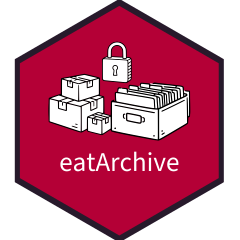

<!-- README.md is generated from README.Rmd. Please edit that file -->

```{r, include = FALSE}
library(badger)
```

# eatArchive <a href="https://buchjani.github.io/eatArchive/"></a>

<!-- badges: start -->
[](https://github.com/buchjani/eatArchive/actions/workflows/R-CMD-check.yaml)
[](https://lifecycle.r-lib.org/articles/stages.html#experimental)
<!-- `r badge_repostatus("Active")` -->
`r badge_last_commit("buchjani/eatArchive")`
`r badge_code_size("buchjani/eatArchive")`
`r badge_custom("author experience", "1st R package", "green", "https://www.iqb.hu-berlin.de/institut/staff/?pg=c163")`
<!-- `r badge_cran_download("eatArchive", "grand-total", "green")` -->
<!-- badges: end -->

eatArchive helps you automate the archiving of directory contents using open, software-agnostic file formats. The package supports scanning nested directories, copying files into a new folder structure, and converting selected formats (e.g., XLSX to CSV, DOCX to PDF/A). Each step is documented in a machine-readable CSV log that records source paths, destination paths, and any format conversions applied.


## Installation

You can install the development version of eatArchive from Github with

``` r
remotes::install_github("buchjani/eatArchive")
```

## Use eatArchive

You can use eatArchive after loading it from your library. Make sure to always refer to the current version when reporting [issues](https://github.com/buchjani/eatArchive/issues)

``` r
library(eatArchive)
```


