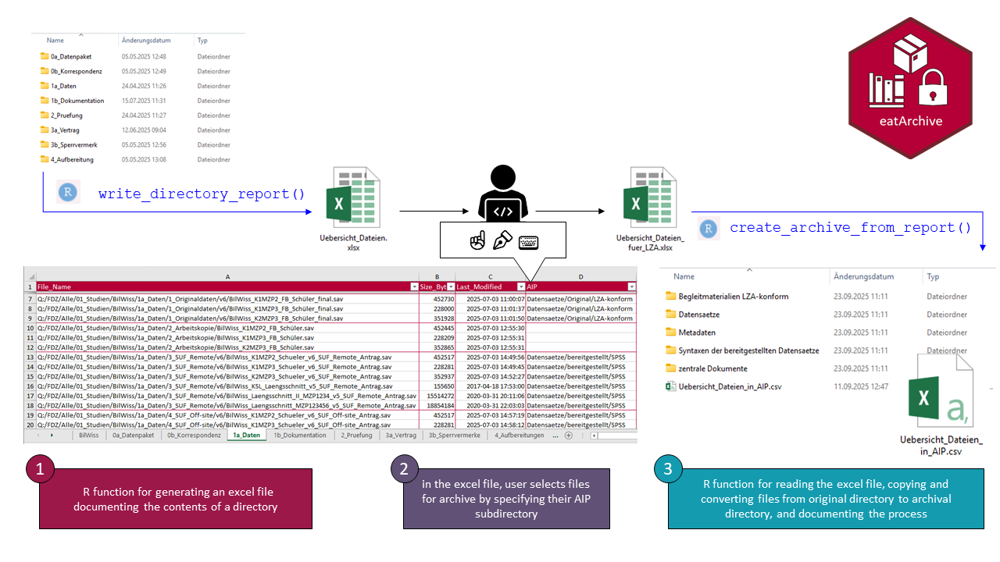

<!-- README.md is generated from README.Rmd. Please edit that file -->

# eatArchive

<!-- badges: start -->

[](https://lifecycle.r-lib.org/articles/stages.html#experimental)
[](https://www.repostatus.org/#active)
[](https://github.com/buchjani/eatArchive/commits/master)
[](https://github.com/buchjani/eatArchive)
[](https://iqb-research.github.io/IQB-Methods/)
[](https://www.iqb.hu-berlin.de/institut/staff/?pg=c163)
<!-- [](https://cran.r-project.org/package=eatArchive) -->
[](https://github.com/buchjani/eatArchive/actions/workflows/R-CMD-check.yaml)
<!-- badges: end -->

eatArchive helps you automate the archiving of directory contents using
open, software-agnostic file formats. The package supports scanning
nested directories, copying files into a new folder structure, and
converting selected formats (e.g., XLSX to CSV, DOCX to PDF/A). Each
step is documented in a machine-readable CSV log that records source
paths, destination paths, and any format conversions applied.

## Installation

You can install the development version of eatArchive from Github with

``` r
remotes::install_github("buchjani/eatArchive")
```

## Workflow

This is a schematic representation of the workflow, consisting of three
major steps:

1.  R function `write_directory_report()` for generating an excel file
    documenting the contents of a directory  
2.  selecting files for archive, by specifying their archival
    subdirectory in the excel file
3.  R function `create_archive_from report()` for reading the excel
    file, copying and converting files from the original directory to
    the archival directory


