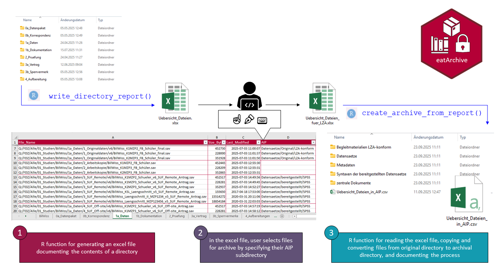

# eatArchive

eatArchive helps you automate the archiving of directory contents using
open, software-agnostic file formats. The package supports scanning
nested directories, copying files into a new folder structure, and
converting selected formats (e.g., XLSX to CSV, DOCX to PDF/A). Each
step is documented in a machine-readable CSV log that records source
paths, destination paths, and any format conversions applied.

## Installation

You can install the development version of eatArchive from Github with

``` r

remotes::install_github("buchjani/eatArchive")
```

## Workflow

This is a schematic representation of the workflow, consisting of three
major steps:

1.  R function
    [`write_directory_report()`](https://buchjani.github.io/eatArchive/reference/write_directory_report.md)
    for generating an excel file documenting the contents of a
    directory  
2.  selecting files for archive, by specifying their archival
    subdirectory in the excel file
3.  R function `create_archive_from report()` for reading the excel
    file, copying and converting files from the original directory to
    the archival directory


